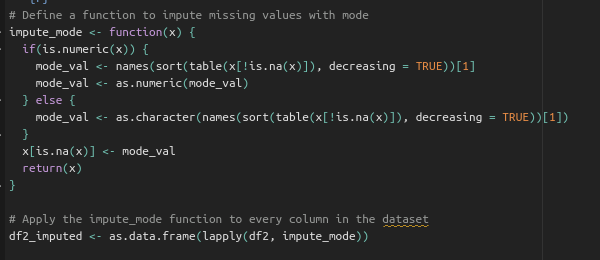
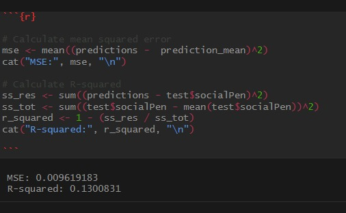

# Econometric-Method-Project-in-R
**Targeting of social transfers: Are India’s poor older people left behind?**

Project Report for

ECON F241: Econometric Methods

**Krishn Parasar:** 2020A7PS2093H

**Shreyash Bhardwaj**: 2020A7PS2066H

**Suraj R Nair**: 2020A7PS0051H

**Mandar Naphade:** 2021B3A72734H

**Aditya Jain:** 2021B3A82573H** 

**Birla Institute of Technology and Science, Pilani,**

**Hyderabad Campus**

Under the supervision of

Prof. [Bheemeshwar Reddy A](mailto:bheem@hyderabad.bits-pilani.ac.in)

**Contents**

1. Introduction

1. Approach
   1. Pre-Processing techniques used
   1. Analysis

1. Table for Descriptive Statistics

1. Interpretation of coefficients for the regressions given in the paper

1. Table for Regression Results

1. Logistic Regression - Model Suggestion

**Introduction** 

The changing demographics, a large informal sector, and weakening family support for the elderly are significant factors contributing to old-age poverty in developing countries. As migration and declining fertility lead to a reduction in the traditional multi-generational household model that supported older people, those working in the informal sector are at increased risk of old-age poverty due to the lack of social protection coverage. 

To address this issue, social pensions, in the form of cash transfers, have been introduced to provide income security for the elderly who lack social protection coverage. The Indian government implemented the National Old Age Pension Scheme in 1995 to support poor older people as part of the National Social Assistance Programme.

` `However, the targeting performance of the social pension scheme for poor older people remains an under-researched topic in India. Existing studies have limitations and do not focus on the effectiveness of the social pension scheme in reducing old-age poverty among the poor older people.

` `Therefore, this study focuses on evaluating the targeting performance of the social pension scheme for poor older people. The success of the social pension scheme in reducing old-age poverty depends on whether it reaches the poor older people, which needs to be assessed accurately.

Firstly, we try to understand the extent to which social pensions are reaching the poor elderly population, which is a crucial requirement to evaluate the effectiveness of social pension schemes in developing countries like India, which face similar targeting challenges. 

Secondly, from a methodological standpoint, this study contributes to existing targeting research by comparing targeting performance indicators to a hypothetical random distribution of social pensions. Furthermore, by utilizing panel data to investigate the factors that affect access to social pension benefits, this study aims to minimize potential omitted variable bias. 

Dataset used : The IHDS dataset by the National Council of Applied Economic Research and the University of Maryland (Desai et al., 2007, 2015).

**Approach**

- First we import the necessary packages and create a subset of the original dataset.
- Then we create a subset of the original dataset for training the model.

The columns shown here are selected and stored in the df2 dataframe.

**Preprocessing Techniques used -**

- ` `First step is to remove ‘useless’ columns from the dataset ,i.e , there are some variables such as time of interview, type of roof in household , animals kept in the house ,etc.

Since these variables are not directly affecting the pension earned by an individual we remove these from the dataset.

- Next up we impute the missing  values in the resulting dataset since these can interfere with our regression results . The following code snippet is how we are imputing missing values.

- After studying the dataset we create new variables that are needed for understanding the regression analysis. For example -

 

Here we checked that RO3 was a variable that represents female category but the categorical variable took value 2 when the gender was female . But while doing regression we prefer the categorical variable to have values as 0 or 1 . So the code above does exactly this . 

Another example is the categorical variable ID11 representing the caste took values 1  for ‘hindu’ , 2 for ‘muslim’ , 3 4 and 5 for ‘SC’ ‘ST’ and ‘OBC’ respectively . So we created 5 new variables each representing the above 5 categories where each column takes a value of 0 or 1 .

  

In similar fashion we created more new variables that were helpful in our regression analysis.

- The following for loop iterates over each numeric column and performs the following steps:

- Creates a boxplot for the column using boxplot(my\_data[[col]], horizontal = TRUE, main = col)

- Identifies potential outliers using the interquartile range (IQR) method. This is done by calling boxplot.stats(my\_data[[col]]), which returns the lower and upper whisker limits of the boxplot.Increments the row\_count counter for each row that contains a potential outlier.

- Finally, the code identifies rows that appear in more than 5 numeric columns using outlier\_rows <- which(row\_count > 5) and removes these rows from the dataset using my\_data <- my\_data[-outlier\_rows, ].In summary, the code detects potential outliers in numeric columns using boxplots and the IQR method and removes rows that contain many outliers.

**Analysis -**

This is a plot of age against number of people who get pension

Out of the 20 important features in the research paper we have listed above the 10 most important features among them , based on ROC curve area.

- ` `The code below was implemented to plot the correlation between the important features.

And the plot obtained can be seen below -

**Level of significance of regression coefficients -** 

These were the values obtained from our regression model depicting level of significance.

<b>RMSE and R2 Values - </b> 

These values obtained are very similar to those seen in the research paper . 

From the above confusion matrix we can see that the predicted values which correspond to the actual values have a high frequency.

**Descriptive Statistics for Variables -** 

<table><tr><th valign="bottom"></th><th colspan="4" valign="bottom"><b>IHDS 2004-05</b></th><th colspan="4" valign="bottom"><b>IHDS 2011-12</b></th><th valign="top"></th></tr>
<tr><td valign="bottom"></td><td valign="bottom"><b>mean</b></td><td valign="bottom"><b>sd</b></td><td valign="bottom"><b>min</b></td><td valign="bottom"><b>max</b></td><td valign="bottom"><b>mean</b></td><td valign="bottom"><b>sd</b></td><td valign="bottom"><b>min</b></td><td valign="bottom"><b>max</b></td><td valign="bottom"><b>Variable category</b></td></tr>
<tr><td valign="bottom"><b>Social pension</b></td><td valign="bottom">0\.033696</td><td valign="bottom">0\.180449</td><td valign="bottom">0</td><td valign="bottom">1</td><td valign="bottom">0\.12621</td><td valign="bottom">0\.332085</td><td valign="bottom">0</td><td valign="bottom">1</td><td valign="bottom">Dependent Variable</td></tr>
<tr><td valign="bottom"><b>Age</b></td><td valign="bottom">57\.35317</td><td valign="bottom">10\.19083</td><td valign="bottom">45</td><td valign="bottom">116</td><td valign="bottom">58\.3808</td><td valign="bottom">10\.64868</td><td valign="bottom">0</td><td valign="bottom">99</td><td rowspan="7">Independent Variables</td></tr>
<tr><td valign="bottom"><b>BPL card</b></td><td valign="bottom">0\.336300</td><td valign="bottom">0\.472448</td><td valign="bottom">0</td><td valign="bottom">1</td><td valign="bottom">0\.39635</td><td valign="bottom">0\.489144</td><td valign="bottom">0</td><td valign="bottom">1</td></tr>
<tr><td valign="bottom"><b>Household assets</b></td><td valign="bottom">12\.97429</td><td valign="bottom">6\.353467</td><td valign="bottom">0</td><td valign="bottom">30</td><td valign="bottom">15\.7197</td><td valign="bottom">6\.228551</td><td valign="bottom">0</td><td valign="bottom">30</td></tr>
<tr><td valign="bottom"><b>Land holding</b></td><td valign="bottom">2\.433287</td><td valign="bottom">7\.169449</td><td valign="bottom">0</td><td valign="bottom">360</td><td valign="bottom">2\.53349</td><td valign="bottom">5\.571165</td><td valign="bottom">-6</td><td valign="bottom">400</td></tr>
<tr><td valign="bottom"><b>Local government connection</b></td><td valign="bottom">0\.108237</td><td valign="bottom">0\.310683</td><td valign="bottom">0</td><td valign="bottom">1</td><td valign="bottom">0\.28194</td><td valign="bottom">0\.449946</td><td valign="bottom">0</td><td valign="bottom">1</td></tr>
<tr><td valign="bottom"><b>Public meeting</b></td><td valign="bottom">0\.303314</td><td valign="bottom">0\.459694</td><td valign="bottom">0</td><td valign="bottom">1</td><td valign="bottom">0\.31136</td><td valign="bottom">0\.463054</td><td valign="bottom">0</td><td valign="bottom">1</td></tr>
<tr><td valign="bottom"><b>Social organization</b></td><td valign="bottom">0\.369087</td><td valign="bottom">0\.482562</td><td valign="bottom">0</td><td valign="bottom">1</td><td valign="bottom">0\.42218</td><td valign="bottom">0\.493912</td><td valign="bottom">0</td><td valign="bottom">1</td></tr>
<tr><td valign="bottom"><b>Watching TV</b></td><td valign="bottom">0\.440364</td><td valign="bottom">0\.496436</td><td valign="bottom">0</td><td valign="bottom">1</td><td valign="bottom">0\.54736</td><td valign="top">0\.497756</td><td valign="top">0</td><td valign="bottom">1</td><td rowspan="9">
Control Variables

</td></tr>
<tr><td valign="bottom"><b>Reading newspaper</b></td><td valign="bottom">0\.207574</td><td valign="bottom">0\.405574</td><td valign="bottom">0</td><td valign="bottom">1</td><td valign="bottom">0\.20759</td><td valign="top">0\.405582</td><td valign="bottom">0</td><td valign="bottom">1</td></tr>
<tr><td valign="bottom"><b>Literate</b></td><td valign="bottom">0\.490821</td><td valign="bottom">0\.499921</td><td valign="bottom">0</td><td valign="bottom">1</td><td valign="bottom">0\.51702</td><td valign="bottom">0\.499715</td><td valign="bottom">0</td><td valign="bottom">1</td></tr>
<tr><td valign="bottom"><b>Education</b></td><td valign="bottom">3\.775156</td><td valign="bottom">4\.688516</td><td valign="bottom">-1</td><td valign="bottom">15</td><td valign="bottom">4\.1003</td><td valign="bottom">4\.813647</td><td valign="bottom">0</td><td valign="bottom">16</td></tr>
<tr><td valign="bottom"><b>Highest adult education in household</b></td><td valign="bottom">7\.807</td><td valign="bottom">5\.059</td><td valign="bottom">0</td><td valign="bottom">15</td><td valign="bottom">8\.703</td><td valign="bottom">5\.095</td><td valign="bottom">0</td><td valign="bottom">16</td></tr>
<tr><td valign="bottom"><b>Working</b></td><td valign="bottom">0\.990077</td><td valign="bottom">0\.099117</td><td valign="bottom">0</td><td valign="bottom">1</td><td valign="bottom">0\.51914</td><td valign="bottom">0\.499638</td><td valign="bottom">0</td><td valign="bottom">1</td></tr>
<tr><td valign="bottom"><b>Permanent job in household</b></td><td valign="bottom">0\.180980</td><td valign="bottom">0\.385006</td><td valign="bottom">0</td><td valign="bottom">1</td><td valign="bottom">0\.07313</td><td valign="bottom">0\.260344</td><td valign="bottom">0</td><td valign="bottom">1</td></tr>
<tr><td valign="bottom"><b>Electrification rate</b></td><td valign="bottom">0\.200492</td><td valign="bottom">0\.400373</td><td valign="bottom">0</td><td valign="bottom">1</td><td valign="bottom">0\.89615</td><td valign="bottom">0\.305070</td><td valign="bottom">0</td><td valign="bottom">1</td></tr>
<tr><td valign="bottom"><b>Village collaboration rate</b></td><td valign="bottom">0\.582055</td><td valign="bottom">0\.493226</td><td valign="bottom">0</td><td valign="bottom">1</td><td valign="bottom">0\.72943</td><td valign="bottom">0\.444260</td><td valign="bottom">0</td><td valign="bottom">1</td></tr>
<tr><td valign="bottom"><b>Peaceful village rate</b></td><td valign="bottom">0\.545605</td><td valign="bottom">0\.497921</td><td valign="bottom">0</td><td valign="bottom">1</td><td valign="bottom">0\.59159</td><td valign="bottom">0\.491545</td><td valign="bottom">0</td><td valign="bottom">1</td><td rowspan="6">Control Variables</td></tr>
<tr><td valign="bottom"><b>Head of household</b></td><td valign="bottom">0\.512375</td><td valign="bottom">0\.499852</td><td valign="bottom">0</td><td valign="bottom">1</td><td valign="bottom">0\.51697</td><td valign="bottom">0\.499716</td><td valign="bottom">0</td><td valign="bottom">1</td></tr>
<tr><td valign="bottom"><b>Widow</b></td><td valign="bottom">0\.202224</td><td valign="bottom">0\.401663</td><td valign="bottom">0</td><td valign="bottom">1</td><td valign="bottom">0\.21299</td><td valign="bottom">0\.409421</td><td valign="bottom">0</td><td valign="bottom">1</td></tr>
<tr><td valign="bottom"><b>Household size</b></td><td valign="bottom">6\.384</td><td valign="bottom">3\.252</td><td valign="bottom">1</td><td valign="bottom">38</td><td valign="bottom">5\.964</td><td valign="bottom">2\.944</td><td valign="bottom">1</td><td valign="bottom">33</td></tr>
<tr><td valign="bottom"><b>Number of adults</b></td><td valign="bottom">3\.509379</td><td valign="bottom">1\.610726</td><td valign="bottom">1</td><td valign="bottom">18</td><td valign="bottom">3\.55701</td><td valign="bottom">1\.587877</td><td valign="bottom">0</td><td valign="bottom">18</td></tr>
<tr><td valign="bottom"><b>Urban</b></td><td valign="bottom">0\.669715</td><td valign="bottom">0\.470320</td><td valign="bottom">0</td><td valign="bottom">1</td><td valign="bottom">0\.35083</td><td valign="bottom">0\.477233</td><td valign="bottom">0</td><td valign="bottom">1</td></tr>
<tr><td valign="bottom"><b>Other backward castes</b></td><td valign="bottom">0\.347133</td><td valign="bottom">0\.476063</td><td valign="bottom">0</td><td valign="bottom">1</td><td valign="bottom">0\.4083</td><td valign="bottom">0\.491523</td><td valign="bottom">0</td><td valign="bottom">1</td><td rowspan="6">
Time-invariant

Characteristics
</td></tr>
<tr><td valign="bottom"><b>Scheduled castes</b></td><td valign="bottom">0\.179227</td><td valign="bottom">0\.383546</td><td valign="bottom">0</td><td valign="bottom">1</td><td valign="bottom">0\.18717</td><td valign="bottom">0\.390054</td><td valign="bottom">0</td><td valign="bottom">1</td></tr>
<tr><td valign="bottom"><b>Female</b></td><td valign="bottom">0\.488268</td><td valign="bottom">0\.499867</td><td valign="bottom">0</td><td valign="bottom">1</td><td valign="bottom">0\.50999</td><td valign="bottom">0\.499905</td><td valign="bottom">0</td><td valign="bottom">1</td></tr>
<tr><td valign="bottom"><b>Hindu</b></td><td valign="bottom">0\.856245</td><td valign="bottom">0\.350844</td><td valign="bottom">0</td><td valign="bottom">1</td><td valign="bottom">0\.8223</td><td valign="bottom">0\.382259</td><td valign="bottom">0</td><td valign="bottom">1</td></tr>
<tr><td valign="bottom"><b>Muslim</b></td><td valign="bottom">0\.101866</td><td valign="bottom">0\.302476</td><td valign="bottom">0</td><td valign="bottom">1</td><td valign="bottom">0\.10572</td><td valign="bottom">0\.307476</td><td valign="bottom">0</td><td valign="bottom">1</td></tr>
<tr><td valign="bottom"><b>Scheduled tribes</b></td><td valign="bottom">0\.07414149</td><td valign="bottom">0\.2620039</td><td valign="bottom">0</td><td valign="bottom">1</td><td valign="bottom">0\.07765</td><td valign="bottom">0\.267623</td><td valign="bottom">0</td><td valign="bottom">1</td></tr>
<tr><td valign="bottom"><b>Asset poor</b></td><td valign="bottom">0\.397567</td><td valign="bottom">0\.489400</td><td valign="bottom">0</td><td valign="bottom">1</td><td valign="bottom">0\.38697</td><td valign="bottom">0\.487061</td><td valign="bottom">0</td><td valign="bottom">1</td><td>Asset poverty measure</td></tr>
</table>

**Interpretation of the coefficients-**

1) ` `**LPM with the baseline specification presented below.**

||
**Linear probability model with individual fixed effects:**

**2004–05 to 2011–12**
||
| :- | :-: | :- |
|**variables**|**coefficient**|**standard error**|
**Level of significance**

**(t-value)**
|
|**After**|0\.0885|0\.0021|41\.819|
|**Age**|0\.0070|0\.0001|73\.402|
|**BPL Card**|0\.0686|0\.0022|30\.577|
|**Household Assets**|-0.0034|0\.0002|-19.597|
|**Land holdings**|-0.0010|0\.0002|-6.618|
|**Local government connection**|0\.0111|0\.0026|4\.218|
|**Public meeting**|0\.0010|0\.0023|`                         `0.433|
|**Social organization**|-0.0079|0\.0021|-3.790|
|||||
|**Observations**|`                                                                                                         `96536||
|**Number of id**|48268||
|**Adjusted within R-squared**|0\.125||

From the table we can interpret the following -

- If the person has the pension scheme in 2011 then there are 8.85% more chances that the person gets pension.
- The coefficient of age tells that for every unit increase  in age pension increases by 0.7%.
- Similarly if a person has a BPL card then that person increases his chance of getting pension by 6.8%
- Note that the effect of land ownings is negligible as is seen from the table.
- On the other hand Local government and public meetings have a positive influence on target variable whereas social organization and household assets have a small negative influence on the chances of getting a pension. 
- Lastly , local government connections increase the chances of getting pension by 1%

From here we can conclude that owning a BPL card is a big factor that influences the chances of getting a pension and hence it  directly supports the existing literature which recommends a reform of the allocation of BPL cards and suggests alternative targeting approaches for social pensions such as the use of clear exclusion criteria that at least prevent clearly non-poor older people from accessing social benefits targeted at the poor and facilitate access to social pensions for the poor older people.

1) **Including interaction with time dummy variable**

|**Variables**|**Coefficients**|**Standard Error**|
| :- | :- | :- |
|**BPL card**|-0.032|0\.01|
|**After X BPL card**|0\.145478|0\.012|
|**Local government connection**|0\.003453|0\.014|
|**After X local government connection**|0\.025093|0\.018|
|**Public meeting**|0\.006939|0\.011|
|**After X public meeting**|0\.003765|0\.014|
|**Social organization**|-0.028652|0\.009|
|**After X social organization**|-0.003961|0\.012|

We can draw the following inferences from the above table -

- Prior to the reform, local government officials were requested to select individuals for the national social pension scheme based on the destitution criterion. Accordingly the results show that if an individual lives in a household that holds a BPL card in 2004–05, his or her likelihood of gaining access to social pensions is reduced by 3.0 percentage points

- In 2011–2012, for an individual who lives in a household that holds a BPL card, the likelihood of receiving a social pension increases by 14.5 percentage  indicating that the centrally reformed eligibility criterion was implemented (at least

to some extent) by the state governments in panchayats and

Municipalities.

- Direct connections with local government officials gained

importance over time. In 2004–05 the relevant coefficient is

insignificant but the estimation of the marginal effects for 2011–

12 indicates that living in a household that has a connection to

the local government is associated with a 2.5 percent  higher likelihood of receiving social pensions.

- Lastly , we can see that public meeting has a small positive  influence in the likelihood of receiving pension and on the other hand social organization has a small negative influence on the target variable which diminishes even further after the pension reforms of 2011.

1) **Including interaction with time and assetPoor variable**

|**Variabes**|**Coeffiicients**|**Standard Errors**|
| :- | :- | :- |
|**BPL Card**|-0.032|0\.013|
|**BPL card X after**|0\.035|0\.016|
|**BPL card X asset poor**|0\.0127056|0\.021|
|**BPL card X after X asset poor**|0\.1092667|0\.027|
|**Local government connection**|0\.006|0\.015|
|**Local government connection X after**|0\.0216704|0\.019|
|**Local government connection X asset poor**|0\.0065993|0\.032|
|**Local government connection X after X asset poor**|0\.0027878|0\.04|
|**Public meeting**|-0.0031567|0\.011|
|**Public meeting X after**|0\.01183|0\.015|
|**Public meeting X asset poor**|-0.011648|0\.023|
|**Public meeting X after X asset poor**|-0.0080511|0\.031|
|**Social organization**|-0.0327048|0\.01|
|**Social organization X after**|-0.0082471|0\.013|
|**Social organization X asset poor**|-0.02046|0\.019|
|**Social organization X after X asset poor**|0\.0013179|0\.027|

- The above two results potentially mask heterogeneity in the factors playing a role for older people from poor and non-poor households.

- To examine the heterogeneity between these two groups for access to social pension benefits before and after the reform, I include triple interaction terms of the time dummy, the variables of interest and the dummy for living in an asset poor household. 

- As explained before, this approach is preferable to using a dummy variable for being poor based on comparing consumption expenditures to the Tendulkar poverty line since the latter are directly affected by the social pension income.

- After the reform, BPL card holding is relevant for individuals living in asset poor and asset non-poor households. For individuals living in asset poor households, BPL card holding is associated with a higher likelihood of receiving social pensions.

- Further, the effect of local government connections on social pension receipt seems to be primarily driven by individuals living in asset non-poor households who are also in general more likely to have better connections to the local government.

**Logistic Regression - Model Suggestion**

We tried various models on our dataset and we have reached the conclusion that a better model to be suggested for better and stronger model for prediction of “Targeting for Social Pension among Elderly people” would be :

**Logistic Regression**

Introduction :

Logistic regression is a popular statistical method used to model the relationship between a binary response variable and one or more predictor variables. It estimates the probability of the occurrence of the response variable based on the values of the predictors. The logit function is used to transform the probability values to a continuous range.

`       `Model hyperparameters and training :

Model specifications after training 

Results :

`                  `**AUC curve for this model :**

As we can see , the accuracy has significantly increased to 79.72% from 59.68% of LinReg Model. 

And the model specificity and sensitivity has also improved.

**Explanation for better performance :**

Logistic regression performs better than linear regression in predicting binary outcomes because it models the relationship between the predictor variables and the probability of the binary outcome, rather than the outcome itself. Linear regression assumes a linear relationship between the predictors and the outcome variable, which is not appropriate for binary outcomes. Logistic regression models the probability of the binary outcome using a logistic or sigmoid function, which constrains the probability values between 0 and 1. This allows for a better fit to the data and improved predictive accuracy. Additionally, logistic regression outputs probabilities, which can be easily converted to class labels using a threshold value, providing more nuanced and interpretable results than linear regression.

